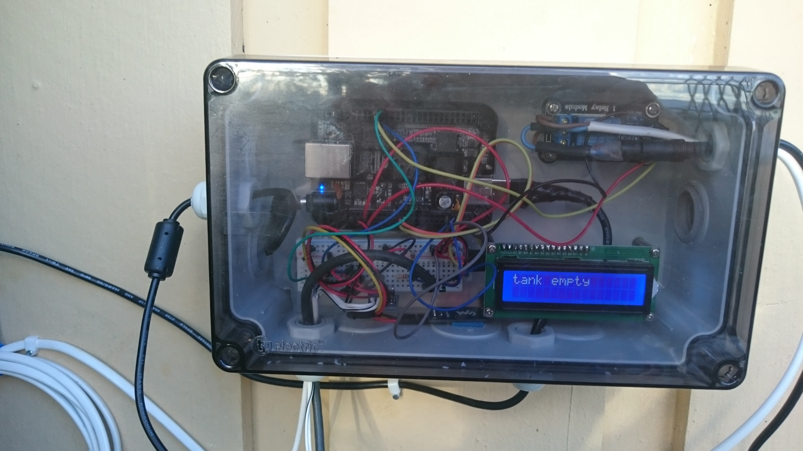
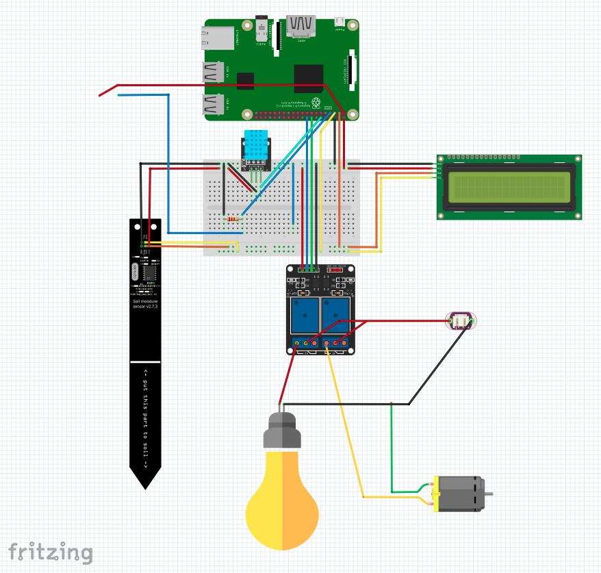
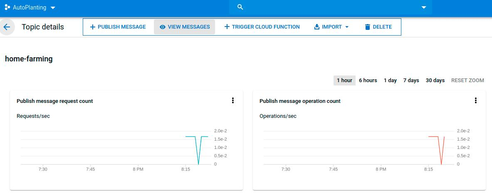
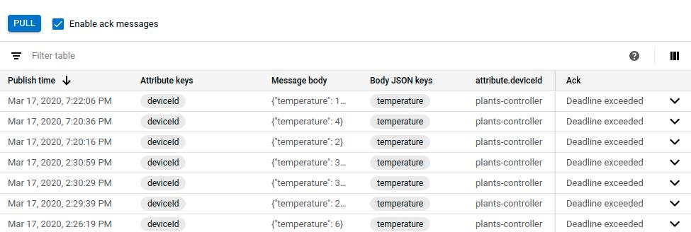
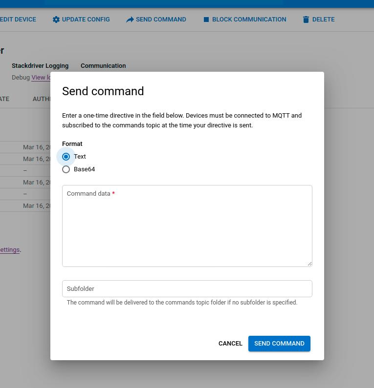
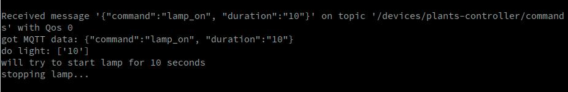
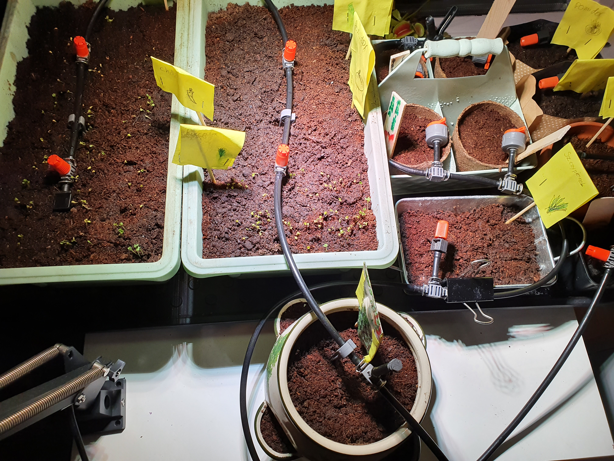

# Growing fresh veggies with Rpi and Mender

Some time ago my wife and I decided to teach our kids how to grow plants. We both have experience as we were raised in small towns where it was common to own a piece of land where you could plant home-grown fresh veggies.

The upbringing of our kids is very different compared to ours, and we realized we never showed our kids how to grow our own veggies. We wanted them to learn and to understand that “the vegetables do not grow on the shop-shelf”, and that there is work (and fun) involved to grow those.

The fact that we are gone for most of the summer and to start our own garden just to see it die when we returned seemed to be pointless. This was a challenge. Luckily, me being a hands-on engineer I promised my wife to take care of it. There were two options: we could buy something that will water our plants when we are gone, or I could do it myself (with a little help from our kids). Obviously I chose the more fun solution…

## Equipment

I decided to design and build an automated system for watering our garden which also helps us grow our indoor herbs garden. The system is ran and managed by Raspberry Pi. I am using version 3, but it should work the same way using RPi v4.

### The heart of the system - pump, tank, sensors

After getting a RPi device I could use, I started thinking about the heart of the system - the water pump. I decided to use a [*small 12V one*](https://www.amazon.com/Portable-Submersible-Campervan-Travelling-Gardening/dp/B01M3XOXQ0/ref=sr_1_43?keywords=Water+Pump+12V+Camper+Caravan&qid=1583253987&sr=8-43), the same that is used inside the campervans, together with some small pipes and spraying nozzles. I found a pretty cool [*Gardena Micro-Drip-System*](https://www.gardena.com/int/products/watering/micro-drip/) as it looked nice, was easy to set up and felt to be a perfect match for what I was building.

In order to run the pump, I used a simple [*single relay module*](https://no.rs-online.com/web/p/power-management-development-kits/8430834/), but later on, when I decided to extend the project to also manage the indoor small herbs garden, I replaced a single module with a double one. This allowed me to run both the pump and the plant growing lamp at the same time. Next, to avoid the pump burning I bought a simple [*liquid level sensor*](https://botland.com.pl/en/liquid-level-sensors/3730-liquid-level-sensor-cmw55-magnetic.html) to prevent the pump from starting when the tank is empty.

This would be all mandatory parts. However, for the fun of it, I also added quite a few optional, to-play-with sensors:

- DHT11 module, which is temperature and humidity sensor

- [*Soil moisture sensor*](https://www.adafruit.com/product/4026), which senses the moisture

- [*Rain sensor*](https://www.amazon.com/Arduino-Sensor-Sensitivity-Weather-Interface/dp/B07L2QW2CV), which is more used outside than inside, obviously :)

Another interesting part I considered is a light sensor to be able to collect more data and make the whole setup even smarter.

Finally, you needed either a prototype board and a bunch of jumper wires (which I am using), or some kind of prototyping plate, wires and some soldering skills (which could be my next project :)).


*Photo of the earlier prototype with BBB instead of RPi*

## Getting started with RPi

It would be handy to update my gardening kit remotely (Over-the-Air / OTA updates) so I decided to start with a [*Rasbian distribution converted with Mender*](https://docs.mender.io/2.3/downloads#disk-images) (which is an OTA updater). Once the image was downloaded and flashed onto the SD card I could start configuring the device. Most of this configuration can be done in advance using the Mender development kit supporting RPi.

### Building and configuring the system

So, let’s get started!

Once the RPi is booted I needed to connect it to my local WiFi network and install all necessary modules and drivers for the sensors we are going to use. To start I needed only to install the required packages to run the hardware. Later on, we will see what other software requirements exist and how to install those. To begin we must be able to seamlessly run the hardware by typing the following inside RPi terminal (after booting for the first time):

```bash
sudo apt update
sudo apt-get install python3-pip
sudo pip3 install --upgrade setuptools
pip3 install RPI.GPIO
pip3 install adafruit-blinka
pip3 install adafruit-circuitpython-dht
sudo apt-get install libgpiod2
pip3 install adafruit-circuitpython-charlcd
sudo apt-get install i2c-tools (for debugging i2c; optional but useful)
```

The above should handle all the HW dependencies, and on top of those make sure to [*enable SPI and I2C*](https://learn.adafruit.com/adafruits-raspberry-pi-lesson-4-gpio-setup/configuring-i2c) as my hardware is using it.

### Hardware schematics

Below is the schematic of the whole setup. There is a lamp and water pump connected through the relay module, DHT11 temperature and humidity sensor, water level sensor, soil moisture sensor and on top of that I am using 2x16 LCD display to show basic system information.



### Out-of-the-box Software

The project source files can be downloaded from Github by running the following command:

*`git clone git@github.com:pasinskim/autoplanting.git`*

To install dependencies run:

*`pip3 install -r requirements.txt`*

This should install all required libraries to both run the system in standalone mode as well as with the ability to connect to the [*GCP IoT core*](https://cloud.google.com/iot-core/).

Before running the project we need to configure the schedule on which both the watering pump and the plants growing lamp will be switched on. For doing this I am using a CRON-like file which can easily be edited to fit specific needs. In order to water the plants every day, let’s say 8 AM for 30 seconds (yes, this is enough to water my small indoor garden, but depending on your setup - pump, valves and various nozzles - you should adjust the time for your needs) and switch the light on for 8 hours every day starting at 9 AM add the following entries:

*`0 9 \* \* \* lamp 28800`*

*`0 8 \* \* \* pump 30`*

To execute the application use the command:

*`python3 autoplant.py --schedule_file=cron-watering`*

Obviously, this is not an optimal way of executing the project as you want your garden managed 24/7, not only as long as you have an active console session. Further, the system should be activated once the RPi is booted and should be restarted if it crashes. The easiest and reliable way for doing this is to leverage systemd and create a service that runs automatically. There are many resources available with detailed instructions that you can follow for creating one. The sample service file can be found inside the repository.

## Access your gardening kit from anywhere

Running the project locally is pretty cool, but what can be better than being able to do it remotely?

### Leveraging Google IoT Core

As [*Mender is integrated with the Google IoT Core*](https://cloud.google.com/blog/products/iot-devices/mender-and-cloud-iot-facilitate-robust-device-update-management) I built remote access together with some online data stores (you guessed right - for storing our measurements) using Google IoT Core. This [*quick start guide*](https://cloud.google.com/iot/docs/quickstart) explains how to create a GCP IoT project. I’ve been using the following commands and configuration for setting up mine:

```bash
cloudshell:\~ (autoplanting)\$ gcloud pubsub topics create home-farming
cloudshell:\~ (autoplanting)\$ gcloud pubsub subscriptions create projects/autoplanting/subscriptions/farming-subscription --topic=home-farming
cloudshell:\~ (autoplanting)\$ gcloud iot registries create registry-farming --project=autoplanting --region=us-central1 --event-notification-config=topic=projects/autoplanting/topics/home-farming
cloudshell:\~ (autoplanting)\$ gcloud iot devices create plants-controller --project=autoplanting --region=us-central1 --registry=registry-farming --public-key path=rsa\_cert.pem,type=rs256
cloudshell:\~ (autoplanting)\$ gcloud projects add-iam-policy-binding autoplanting --member=serviceAccount:cloud-iot@system.gserviceaccount.com --role=roles/pubsub.publisher
```

#### Create a device key and connect

Once the GCP configuration is done you should create a device key by running:

*`openssl req -x509 -newkey rsa:2048 -keyout rsa\_private.pem -nodes -out rsa\_cert.pem -subj "/CN=unused"`*

This should produce two files: *rsa\_private.pem* and *rsa\_cert.pem.* Copy *rsa\_private.pem* and store it securely on your RPi device. You will need it for connecting to GCP.

Once the configuration is done you can run the client by typing in the terminal:

*`python3 autoplant.py --algorithm=RS256 --device_id=plants-controller --private_key_file=./rsa_private.pem --registry_id=registry-farming --project_id=autoplanting --schedule_file=cron-planting --do_mqtt`*

Make sure all the parameters correspond to your GCP project configuration.

Once I started the client measurements to GCP over MQTT were sent. It works!





#### Sending commands - for the fun of it

It is easy to [*send commands*](https://cloud.google.com/iot/docs/how-tos/commands) to the device and start the lamp or pump remotely. It is configured by default, but before doing this I had to make sure the device was registered to the *commands/\#* MQTT topic so that it could receive all the commands sent through the GCP web interface.



For example sending, *{"command":"lamp\_on", "duration":"10"}* to the device, I see the following in the terminal, and obviously my light went on for 10 seconds!



## Remotely OTA software update to keep my garden fresh

As the whole configuration of the board, extra libraries and the code for running the automated garden requires some steps and can get quite complicated, it is possible to do it much more easily with Mender.

By using Mender, I get the out-of-the-box mechanism for updating my software remotely which might be extremely useful if I can not have physical access to my device, I have multiple devices and updating all of those manually will be very time-consuming, error-prone and extremely inefficient, or I simply want to impress my folks :)

To use Mender, I, first of all, needed a Hosted Mender account. The setup process is very easy, even better, for small projects, the account is free of charge. There is a step-by-step guide for how to do it [*here*](https://docs.mender.io/2.3/getting-started/quickstart-with-raspberry-pi).

Once my device is configured and registered with Hosted Mender I can download and use this artifact to automatically install all the dependencies and copy the project code over.

I have made this automated garden management software available for all of you, and for safety reasons the application won’t be started automatically as you may need to tweak the source code to adapt it to your hardware configuration (mainly different GPIOs used for connecting various sensors). Once the configuration is done you can safely run the automated gardening system by typing below inside your RPi terminal:

*`sudo systemctl automatic-garden start`*

In addition to configure your board and software extremely easily, you can now enjoy Mender to do any needed software updates in the future.

## Summary

This concludes the first part of this blog post. I have my device up and running and configured so that it can send data and receive commands from Google IoT core. What is more, all the MQTT data is stored inside Google Pub/Sub middleware and the communication with the device is active. I hope you will get here as well by following the steps I did.

Finally, this might be the foundation for creating a scalable backend and client mobile application for easy data visualization and communication with our automated garden which will be some work for the future and the second part of this blog post.



**Enjoy your fresh veggies! Ours are growing already!**
